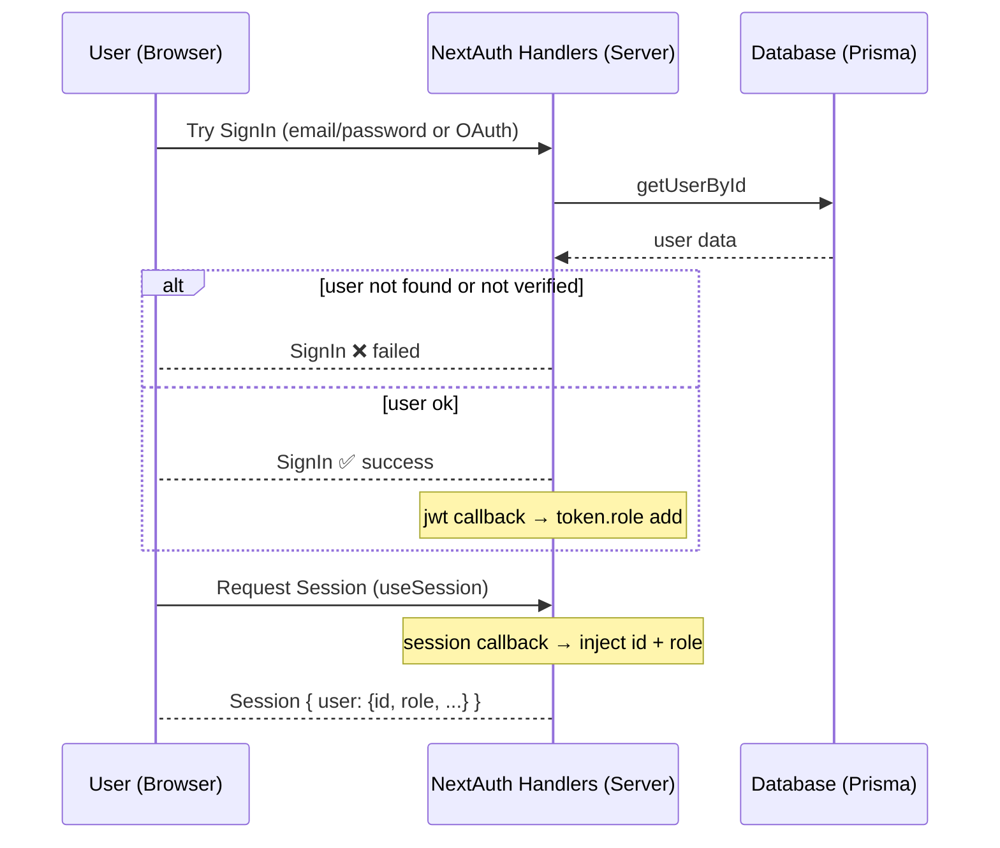

# NextAuth callbacks, TypeScript augmentation এবং flow (বাংলায় — beginner friendly)

**সংক্ষিপ্ত পরিচিতি**  
এই নোটে আপনি শিখবেন — `signIn`, `jwt`, `session` callbacks কীভাবে কাজ করে, প্রতিটি কোড কীভাবে রান হয়, তাদের flow কীভাবে চলে এবং diagram সহ সহজভাবে বুঝবেন।

---

## 1) `signIn` callback
```ts
async signIn({ user }) {
  const existingUser = await getUserById(user.id)
  if (!existingUser || !existingUser.emailVerified) {
    return false
  }
  return true
}
```
### কীভাবে কাজ করে:
- যখন কোনো user লগইন করার চেষ্টা করে তখন `signIn` callback প্রথমে চলে।
- এখানে database থেকে ইউজার খোঁজা হয় (`getUserById`).
- যদি user না থাকে বা email ভেরিফাই না হয় → `false` রিটার্ন করে লগইন বন্ধ করে দেয়।
- অন্যথায় `true` রিটার্ন করে লগইন সফল করে।

📌 **Flow**:
```
User → signIn callback → DB check → (not verified? ❌ stop) else ✅ allow
```

---

## 2) `jwt` callback
```ts
async jwt({ token }) {
  console.log("it's from token ", token)

  if (!token.sub) return token
  const existingUser = await getUserById(token.sub)
  if (!existingUser) return token

  token.role = existingUser.role

  return token
}
```
### কীভাবে কাজ করে:
- যখন নতুন user সাইন ইন করে বা session fetch হয়, `jwt` callback চলে।
- `token.sub` = user.id
- DB থেকে user বের করা হয়।
- User এর role টোকেনে যোগ করা হয়।
- এই `token` এরপর client এর cookie/session-এ থাকে।

📌 **Flow**:
```
SignIn / Session fetch → jwt callback → DB থেকে user role → token.role add → return token
```

---

## 3) `session` callback
```ts
async session({ token, session }) {
  console.log({ sessionToken: token })

  if (token.sub && session.user) {
    session.user.id = token.sub
  }

  if (token.role && session.user) {
    session.user.role = token.role as UserRole
  }

  return session
}
```
### কীভাবে কাজ করে:
- Client side (যখন `useSession()` ব্যবহার করেন বা `/api/auth/session` কল হয়) তখন `session` callback চালু হয়।
- এখানে `token` থেকে session.user এর মধ্যে `id` এবং `role` ইনজেক্ট করা হয়।
- ফলে browser এ session object এ user.id এবং user.role দেখা যায়।

📌 **Flow**:
```
Client → /api/auth/session → session callback → session.user.id + role inject → return session
```

---

## 4) টাইপ ডেফিনিশন — কেন লাগলো?
```ts
// src/types/next-auth.d.ts
declare module "next-auth" {
  interface Session {
    user: {
      id: string
      role: UserRole
    } & DefaultSession["user"]
  }

  interface User {
    id: string
    role: UserRole
  }
}

declare module "next-auth/jwt" {
  interface JWT {
    id: string
    role: UserRole
  }
}
```
### ব্যাখ্যা:
- Default NextAuth টাইপে শুধু `id, name, email, image` থাকে।
- আমরা `role` যুক্ত করেছি `Session.user`, `User` এবং `JWT` interface এ।
- ফলে TypeScript আর error দিবে না।

📌 **Flow**:
```
TypeScript compile time → next-auth.d.ts check → role ফিল্ড বুঝবে → no error
```

---

## 5) Overall Flow Diagram


---

## 6) Client side debug
```tsx
"use client"
import { useSession } from "next-auth/react"

export default function DebugSession() {
  const { data: session, status } = useSession()

  if (status === "loading") return <p>Loading...</p>

  console.log("SESSION (client):", session)

  return (
    <div>
      <h3>Session (client)</h3>
      <pre>{JSON.stringify(session, null, 2)}</pre>
    </div>
  )
}
```
### কীভাবে কাজ করে:
- `useSession()` client থেকে session নিয়ে আসে।
- session callback থেকে inject হওয়া `id` এবং `role` এখানে পাওয়া যায়।

📌 **Flow**:
```
Client → useSession() → server session callback → return session → console.log দেখাবে
```

---

## 7) Summary
- `signIn` callback: লগইন এর আগে user check
- `jwt` callback: user info টোকেনে যোগ করা
- `session` callback: token → session.user এ data inject
- TypeScript augmentation: compile-time error দূর করা
- Client side: `useSession()` দিয়ে session দেখা

এইভাবে প্রত্যেকটি কোড step-by-step কাজ করে এবং পুরো flow সহজে বোঝা যায়।